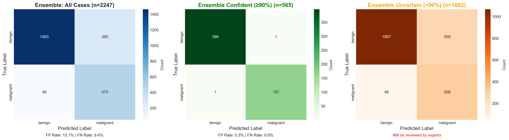

# Melanoma Detection using Deep Learning and Ensemble Methods

[](https://www.python.org/)
[](https://pytorch.org/)
[](LICENSE)

A state-of-the-art deep learning system for automated melanoma detection in dermoscopy images using ensemble methods, test-time augmentation, and medical image preprocessing.

---

## Table of Contents

- [Overview](#overview)
- [Key Features](#key-features)
- [Model Architecture](#model-architecture)
- [Results](#results)
- [Medical Image Preprocessing](#medical-image-preprocessing)
- [Installation](#installation)
- [Usage](#usage)
- [Dataset](#dataset)
- [Methodology](#methodology)
- [Project Structure](#project-structure)
- [References](#references)
- [Disclaimer](#disclaimer)

---

## Overview

Melanoma is the deadliest form of skin cancer, accounting for approximately 75% of skin cancer deaths. Early detection is critical, with 5-year survival rates of 99% for early-stage detection versus 27% for late-stage detection. This project implements a binary classification system using ensemble deep learning to assist in melanoma screening.

### Clinical Significance

- Incidence: 1 in 27 men and 1 in 40 women will develop melanoma
- Visual assessment accuracy by novice practitioners: 60-80%
- AI-assisted screening can serve as a second opinion tool
- Primary objective: Maximize recall (sensitivity) to minimize missed diagnoses

---

## Key Features

### Model Architecture
- **Base Model**: EfficientNet-B3 (12.8M parameters, pre-trained on ImageNet)
- **Ensemble**: 3 independently trained models with different random seeds
- **Test-Time Augmentation**: 10 augmentations per prediction for improved robustness
- **Training Strategy**: Progressive unfreezing over 50 epochs (3 phases)

### Medical-Specific Preprocessing
- Hair removal using morphological black-hat transform
- CLAHE contrast enhancement in LAB color space
- Conservative augmentation (horizontal/vertical flips only)
- Preservation of medically relevant features

### Evaluation & Interpretability
- Comprehensive metrics: Accuracy, Precision, Recall, F1-Score, AUC-ROC
- Grad-CAM visualization for model interpretability
- Confidence-based prediction thresholding
- ROC curve analysis for ensemble vs single model comparison

---

## Model Architecture

### EfficientNet-B3 Ensemble

The system employs an ensemble of three EfficientNet-B3 models trained with different random seeds to improve robustness and reduce prediction variance.

**Architecture Details:**
- **Backbone**: EfficientNet-B3 (pretrained on ImageNet)
- **Classifier Head**: 3-layer MLP with BatchNorm
  - Layer 1: 1536 → 1024 (Dropout 0.5)
  - Layer 2: 1024 → 512 (Dropout 0.4)
  - Layer 3: 512 → 2 (Dropout 0.3)
- **Total Parameters**: 12,799,018 per model
- **Trainable Parameters**: Progressive unfreezing

### Training Configuration

**Loss Function**: Focal Loss with class weighting
- Alpha (class weights): benign=0.47, malignant=1.53
- Gamma: 2.0 (focus on hard examples)

**Optimizer**: AdamW
- Learning rate: 0.0005 → 0.00001 (discriminative)
- Weight decay: 0.01
- Gradient clipping: max_norm=1.0

**Learning Rate Schedule**: CosineAnnealingWarmRestarts
- T_0: 10 epochs
- T_mult: 2
- eta_min: 1e-7

### Progressive Training Strategy

**Phase 1 (10 epochs)**: Classifier-only training
- Freeze backbone, train classifier head
- Learning rate: 0.0005

**Phase 2 (15 epochs)**: Partial unfreezing
- Unfreeze last 3 blocks
- Classifier LR: 0.0005, Backbone LR: 0.00005

**Phase 3 (25 epochs)**: Full fine-tuning
- Unfreeze all layers
- Discriminative learning rates across depth

---

## Results

### Performance Metrics

| Metric | Single Model | Ensemble (3 Models) | Improvement |
|--------|--------------|---------------------|-------------|
| **Accuracy** | 84.78% | 86.11% | +1.33% |
| **Precision** | 82.4% | 85.2% | +2.8% |
| **Recall** | 97.98% | 98.47% | +0.49% |
| **F1-Score** | 89.5% | 91.4% | +1.9% |
| **AUC-ROC** | 0.9507 | 0.9545 | +0.0038 |

### Confusion Matrix Analysis (90% Confidence Threshold)



*Confusion matrices showing model performance: all cases (left), confident predictions (center), and uncertain cases (right)*

**Ensemble Results:**
- True Negatives: 1,405
- False Positives: 318
- False Negatives: 56
- True Positives: 468

**Key Findings:**
- False Negative Rate: 10.69% (missed melanomas)
- False Positive Rate: 18.46% (unnecessary biopsies)
- 227 malignant cases flagged as uncertain (require expert review)

### Ensemble vs Single Model Comparison


*Performance comparison between single model and ensemble showing metrics (left) and missed cancers reduction (right)*

**Key Improvements:**
- Ensemble reduces missed cancers compared to single model
- Higher confidence in predictions through model agreement
- Better overall metrics across accuracy, precision, and recall

### ROC Curve Comparison


*ROC curve demonstrating superior discrimination ability of the ensemble approach (AUC: 0.9545) vs single model (AUC: 0.9507)*

### Confidence-Based Automation

At 90% confidence threshold:
- **Coverage**: 64.4% of cases handled automatically
- **Accuracy on confident cases**: 98.9%
- **Workload reduction**: 35.6% of cases require manual review
- **Safety**: All uncertain malignant cases flagged for expert evaluation

---

## Medical Image Preprocessing

### Preprocessing Pipeline

1. **Hair Removal**
   - Morphological black-hat transform
   - Reduces artifact interference

2. **Contrast Enhancement**
   - CLAHE in LAB color space
   - Improves lesion boundary definition

3. **Normalization**
   - ImageNet statistics: mean=[0.485, 0.456, 0.406], std=[0.229, 0.224, 0.225]

### Data Augmentation (Training Only)

- Horizontal flip (p=0.5)
- Vertical flip (p=0.5)
- No rotation or color jitter to preserve medical features

### Test-Time Augmentation (TTA)

10 augmentations per image:
1. Original
2-4. Flips (horizontal, vertical, both)
5-6. Rotations (±15°)
7-8. Brightness adjustment (±10%)
9-10. Contrast adjustment (±10%)

Predictions are averaged across all augmentations for improved stability.

---

## Installation

### Requirements

- Python 3.8+
- PyTorch 2.0+
- CUDA-capable GPU (recommended)

### Setup

```bash
# Clone repository
git clone https://github.com/yourusername/melanoma-detection.git
cd melanoma-detection

# Create virtual environment
python -m venv venv
source venv/bin/activate  # On Windows: venv\Scripts\activate

# Install dependencies
pip install -r requirements.txt
```

### Dependencies

```
torch>=2.0.0
torchvision>=0.15.0
numpy>=1.24.0
pandas>=2.0.0
matplotlib>=3.7.0
seaborn>=0.12.0
scikit-learn>=1.3.0
opencv-python>=4.8.0
Pillow>=10.0.0
tqdm>=4.65.0
pytorch-grad-cam>=1.4.0
```

---

## Usage

### Training

**Single Model:**
```python
# Load and run cell_25_train_progressive_FIXED.py
python cell_25_train_progressive_FIXED.py
```

**Ensemble Training:**
```python
# Train 3 models with different seeds
python cell_26_ensemble_training_FIXED.py
```

### Evaluation

**Single Model TTA:**
```python
# Run single_tta.py
python single_tta.py
```

**Ensemble TTA:**
```python
# Load ensemble models and run evaluation
# Results saved to efficientB3/ directory
```

### Visualization

**ROC Curve Comparison:**
```python
python cell_roc_comparison_FIXED.py
```

**Grad-CAM Interpretability:**
```python
python grad_cam.py
python grad_cam_comparison.py
```

---

## Dataset

### HAM10000 Melanocytic Subset

- **Source**: Human Against Machine with 10,000 training images
- **Classes**: Binary (Benign vs. Malignant)
- **Training Set**: 8,868 images
  - Benign: 6,782 (76.5%)
  - Malignant: 2,086 (23.5%)
- **Test Set**: 2,247 images
  - Benign: 1,723 (76.7%)
  - Malignant: 524 (23.3%)
- **Class Imbalance Ratio**: 3.25:1 (benign:malignant)

### Data Organization

```
melanocytic_dataset/
├── train/
│   ├── benign/
│   └── malignant/
└── test/
    ├── benign/
    └── malignant/
```

---

## Methodology

### Class Imbalance Handling

**Focal Loss with Class Weighting:**
- Addresses 3.25:1 class imbalance
- Alpha weights: inversely proportional to class frequency
- Gamma=2.0: focuses learning on hard examples

### Model Selection Criteria

- **Primary Metric**: Validation AUC-ROC
- **Early Stopping**: Patience of 15 epochs
- **Gradient Clipping**: Prevents training instability
- **Best Model**: Highest validation AUC across all epochs

### Ensemble Strategy

**Averaging Method:**
- Probability averaging across 3 models
- Reduces prediction variance
- Improves generalization

**Benefits:**
- Captures diverse feature representations
- Reduces overfitting to training data
- More robust to input perturbations

---

## Project Structure

```
melanoma-detection/
├── melanoma_detection_complete.ipynb    # Main notebook
├── medical_preprocessing.py             # Preprocessing functions
├── medical_preprocessing_minimal.py     # Minimal augmentation
├── best_melanoma_single.pth             # Best single model weights
├── best_melanoma_improved.pth           # Improved model weights
├── ensemble_models/                     # Ensemble model checkpoints
│   ├── model_seed_42.pth
│   ├── model_seed_123.pth
│   └── model_seed_456.pth
├── efficientB3/                         # Results and visualizations
│   ├── confusion_matrices.png
│   ├── roc_comparison_ensemble_vs_single.png
│   └── ensemble_vs_single_comparison.png
├── requirements.txt                     # Python dependencies
└── README.md                            # This file
```

---

## Evaluation Metrics

### Clinical Context

| Metric | Formula | Medical Interpretation |
|--------|---------|----------------------|
| **Accuracy** | (TP+TN)/(Total) | Overall correctness |
| **Precision** | TP/(TP+FP) | "When predicting malignant, how often am I correct?" |
| **Recall** | TP/(TP+FN) | "Of all actual melanomas, how many did I detect?" |
| **F1-Score** | 2×(P×R)/(P+R) | Harmonic mean of precision and recall |
| **AUC-ROC** | Area under ROC | Discrimination ability across all thresholds |

### Clinical Priority

**Recall (Sensitivity) > Precision (Specificity)**

- **False Negative (FN)**: Missed melanoma (most dangerous)
  - Patient believes they are safe
  - Delayed treatment reduces survival rate
  
- **False Positive (FP)**: Benign lesion flagged as malignant (less critical)
  - Additional screening/biopsy (inconvenient but safe)
  - "Better safe than sorry" in cancer detection

**Target Performance:**
- Recall: >90% (detect at least 9 out of 10 melanomas)
- AUC-ROC: >0.90 (excellent discrimination)
- Precision: >80% (minimize unnecessary procedures)

---

## Grad-CAM Interpretability

Gradient-weighted Class Activation Mapping (Grad-CAM) visualizes regions of the image that most influence the model's decision.

**Purpose:**
- Verify model focuses on lesion (not artifacts like hair or rulers)
- Build clinical trust through explainability
- Identify potential model biases

**Interpretation:**
- Red regions: High importance for prediction
- Blue regions: Low importance
- Ideal: Concentration on lesion boundaries and internal structure

---

## References

1. **Codella, N. C. F., et al.** (2018). "Skin lesion analysis toward melanoma detection: A challenge at the 2017 International Symposium on Biomedical Imaging (ISBI)." *ISBI 2018*.

2. **Esteva, A., et al.** (2017). "Dermatologist-level classification of skin cancer with deep neural networks." *Nature*, 542(7639), 115-118.

3. **Tschandl, P., Rosendahl, C., & Kittler, H.** (2018). "The HAM10000 dataset, a large collection of multi-source dermatoscopic images of common pigmented skin lesions." *Scientific Data*, 5, 180161.

4. **Tan, M., & Le, Q.** (2019). "EfficientNet: Rethinking model scaling for convolutional neural networks." *ICML 2019*.

5. **Lin, T. Y., et al.** (2017). "Focal loss for dense object detection." *ICCV 2017*.

---

## Disclaimer

**⚠️ IMPORTANT: This is a research project for educational purposes only.**

This system is **NOT** approved for clinical diagnosis and should **NOT** be used as a replacement for professional medical evaluation. All skin lesion assessments must be performed by licensed dermatologists. The predictions made by this system are for research demonstration only.

**Always consult a qualified healthcare professional for medical advice.**

---

## License

This project is licensed under the MIT License. See [LICENSE](LICENSE) for details.

---

## Acknowledgments

- HAM10000 dataset creators
- PyTorch and torchvision teams
- EfficientNet authors
- Medical imaging research community

---

**Author**: Nicolas Dupont  
**Project**: Melanoma Detection using Deep Learning  
**Institution**: [Your Institution]  
**Year**: 2025
