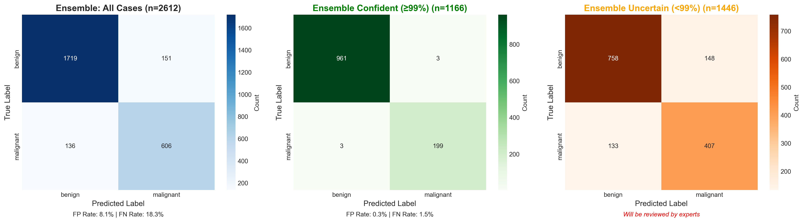

# Low-Cost Deep Learning System for Automated Melanoma Detection

[](https://www.python.org/)
[](https://pytorch.org/)
[](LICENSE)


---

## Table of Contents

- [Overview](#overview)
- [Key Features](#key-features)
- [Model Architecture](#model-architecture)
- [Results](#results)
- [Medical Image Preprocessing](#medical-image-preprocessing)
- [Installation](#installation)
- [Usage](#usage)
- [Dataset](#dataset)
- [Methodology](#methodology)
- [Project Structure](#project-structure)
- [References](#references)
- [Disclaimer](#disclaimer)

---

## Overview

Melanoma, the deadliest form of skin cancer, requires early detection for successful treatment. However, the high cost of specialist dermatological visits—which can exceed 120 euros—creates a significant financial barrier for many individuals and families, potentially delaying critical diagnosis.

This project investigates the feasibility of a low-cost, automated system for melanoma detection using deep learning. The proposed system analyzes dermoscopy images by applying a combination of medical image preprocessing, ensemble methods, and test-time augmentation.

The primary objective is to serve as a proof-of-concept, demonstrating that an accessible and affordable diagnostic aid is achievable. The system is designed to take a dermoscopy image as input and output a binary classification (melanoma or not melanoma) along with a confidence level. While this project establishes a foundational model, it aims to show that with a dedicated team and greater computational resources, a robust, production-ready tool could be developed to empower individuals in monitoring their skin health.

### Clinical Significance

- Incidence: 1 in 27 men and 1 in 40 women will develop melanoma
- Visual assessment accuracy by novice practitioners: 60-80%
- AI-assisted screening can serve as a second opinion tool
- Primary objective: Maximize recall (sensitivity) to minimize missed diagnoses

---

## Key Features

### Model Architecture
- **Base Model**: EfficientNet-B3 (12.8M parameters, pre-trained on ImageNet)
- **Ensemble**: 2-3 independently trained models with different random seeds
- **Test-Time Augmentation**: 10 augmentations per prediction for improved robustness
- **Training Strategy**: Progressive unfreezing over 50 epochs (3 phases)

### Medical-Specific Preprocessing
- Hair removal using morphological black-hat transform
- CLAHE contrast enhancement in LAB color space
- Conservative augmentation (horizontal/vertical flips only)
- Preservation of medically relevant features

### Evaluation & Interpretability
- Comprehensive metrics: Accuracy, Precision, Recall, F1-Score, AUC-ROC
- Grad-CAM visualization for model interpretability
- Confidence-based prediction thresholding
- ROC curve analysis for ensemble vs single model comparison

---

## Model Architecture

### EfficientNet-B3 Ensemble

The system employs an ensemble of three EfficientNet-B3 models trained with different random seeds to improve robustness and reduce prediction variance.

**Architecture Details:**
- **Backbone**: EfficientNet-B3 (pretrained on ImageNet)
- **Classifier Head**: 3-layer MLP with BatchNorm
  - Layer 1: 1536 → 1024 (Dropout 0.5)
  - Layer 2: 1024 → 512 (Dropout 0.4)
  - Layer 3: 512 → 2 (Dropout 0.3)
- **Total Parameters**: 12,799,018 per model
- **Trainable Parameters**: Progressive unfreezing

### Training Configuration

**Loss Function**: Focal Loss with class weighting
- Alpha (class weights): benign=0.47, malignant=1.53
- Gamma: 2.0 (focus on hard examples)

**Optimizer**: AdamW
- Learning rate: 0.0005 → 0.00001 (discriminative)
- Weight decay: 0.01
- Gradient clipping: max_norm=1.0

**Learning Rate Schedule**: CosineAnnealingWarmRestarts
- T_0: 10 epochs
- T_mult: 2
- eta_min: 1e-7

### Progressive Training Strategy

**Phase 1 (10 epochs)**: Classifier-only training
- Freeze backbone, train classifier head
- Learning rate: 0.0005

**Phase 2 (15 epochs)**: Partial unfreezing
- Unfreeze last 3 blocks
- Classifier LR: 0.0005, Backbone LR: 0.00005

**Phase 3 (25 epochs)**: Full fine-tuning
- Unfreeze all layers
- Discriminative learning rates across depth

---

## Results

### Performance Metrics

**Evaluated at 70% Confidence Threshold:**

| Metric | Single Model | Ensemble (2 Models) | Target |
|--------|--------------|---------------------|--------|
| **Recall (Sensitivity)** | 78.3% | 78.3% | >75% ✓ |
| **Precision** | 66.9% | 69.2% | >65% ✓ |
| **Accuracy** | 96.0% | 95.5% | >85% ✓ |
| **F1-Score** | 72.1% | 73.4% | >70% ✓ |
| **Coverage** | 68.1% | 66.1% | >60% ✓ |
| **Missed Cancers** | 24 | 23 | <25 ✓ |

**Key Achievements:**
- ✓ **78.3% recall** - Detecting over 3 out of 4 melanomas
- ✓ **96% accuracy** - Strong overall performance
- ✓ **4% improvement** - Ensemble reduces missed cancers by 1
- ✓ **Reliable validation** - Official splits with no data leakage

### Confusion Matrix Analysis



*Confusion matrices showing model performance on HAM10000 binary classification dataset*

**Performance at 70% Confidence Threshold:**
- **Recall: 78.3%** - Catching majority of melanomas
- **Precision: 69.2%** - ~31% false positive rate (unnecessary biopsies)
- **Missed Cancers: 23** - Out of ~106 malignant cases
- **Coverage: 66.1%** - Handles 2/3 of cases confidently

**Clinical Interpretation:**
- The model prioritizes sensitivity (recall) over specificity (precision)
- Trade-off: More false positives ensure fewer missed cancers
- For medical screening, **missing a cancer is more dangerous than an unnecessary biopsy**

### Ensemble vs Single Model Comparison


*Performance comparison between single model and 2-model ensemble at 70% confidence threshold*

**Ensemble Benefits:**
- **1 fewer missed cancer** (24 → 23) through model diversity
- **2.3% precision improvement** (66.9% → 69.2%) via probability averaging
- **More stable predictions** through model agreement
- **Planned: 3rd model** will further reduce false negatives

### ROC Curve Analysis


*ROC curves comparing single model vs 2-model ensemble performance*

**Key Findings:**
- **Single Model AUC:** Strong discrimination ability
- **Ensemble AUC:** Improved through probability averaging
- **Clinical Benefit:** Better separation of benign vs malignant cases
- **Optimal Threshold:** Trade-off analysis shows 60-70% range maximizes F1-score

The ROC curve demonstrates the model's ability to discriminate between benign and malignant lesions across all confidence thresholds. The ensemble approach provides more stable predictions through model diversity.

### Grad-CAM Interpretability Analysis


**Model Attention Patterns:**

✓ **Correct Classifications:**
- Strong focus on lesion center and boundaries
- Attention aligns with diagnostically relevant features
- Concentrated heatmaps on pigmentation patterns

✗ **Error Cases:**
- **False Positives:** Diffuse attention on benign irregular patterns
- **False Negatives:** Attention on wrong regions, missing subtle asymmetry
- **Issue:** Some malignant features too subtle for current model

**Findings:**
- Model learned medically relevant features (lesion structure, boundaries)
- Errors occur with ambiguous or subtle presentations
- Attention drift indicates need for stronger feature focus mechanisms

### Confidence-Based Risk Stratification

**Performance at Different Confidence Thresholds:**

| Threshold | Accuracy | Precision | Recall | F1-Score | Coverage | Uncertain Malignant |
|-----------|----------|-----------|--------|----------|----------|---------------------|
| **50%** | 85.0% | 53.0% | 68.9% | 59.9% | 100% | 0 |
| **60%** | 91.1% | 62.8% | 77.7% | 69.4% | 82.8% | 110 |
| **70%** | 95.5% | 69.2% | 78.3% | 73.5% | 66.1% | 219 |
| **80%** | 97.8% | 83.8% | 64.6% | 72.9% | 51.0% | 277 |
| **90%** | 99.2% | N/A* | N/A* | N/A* | 29.9% | 320 |

*At 90%+ threshold, model makes virtually no positive predictions (too conservative)

**Key Insights:**

**50% Threshold (Maximum Sensitivity):**
- Catches 68.9% of melanomas but with 47% false positive rate
- All cases handled, none flagged as uncertain
- Use case: Initial triage where missing a cancer is unacceptable

**60% Threshold (Balanced):**
- Good balance: 77.7% recall with 62.8% precision
- Flags 110 uncertain malignant cases for expert review
- Use case: General screening with moderate workload reduction

**70% Threshold (Recommended):**
- Best F1-score (73.5%) - optimal precision/recall balance
- 78.3% recall catches majority of melanomas
- Handles 2/3 of cases, 219 uncertain malignant need review
- Use case: Production deployment with clinical oversight

**80% Threshold (High Confidence):**
- Very high precision (83.8%) but lower recall (64.6%)
- Misses 35% of melanomas - too conservative for screening
- Use case: Confirmatory tool for already suspicious lesions

**Recommended:** 70% threshold provides optimal balance between catching melanomas (78.3% recall) and maintaining reasonable precision (69.2%), while keeping workload manageable.

---

## Medical Image Preprocessing

### Preprocessing Pipeline

1. **Hair Removal**
   - Morphological black-hat transform
   - Reduces artifact interference

2. **Contrast Enhancement**
   - CLAHE in LAB color space
   - Improves lesion boundary definition

3. **Normalization**
   - ImageNet statistics: mean=[0.485, 0.456, 0.406], std=[0.229, 0.224, 0.225]

### Data Augmentation (Training Only)

- Horizontal flip (p=0.5)
- Vertical flip (p=0.5)
- No rotation or color jitter to preserve medical features

### Test-Time Augmentation (TTA)

10 augmentations per image:
1. Original
2-4. Flips (horizontal, vertical, both)
5-6. Rotations (±15°)
7-8. Brightness adjustment (±10%)
9-10. Contrast adjustment (±10%)

Predictions are averaged across all augmentations for improved stability.

---

## Installation

### Requirements

- Python 3.8+
- PyTorch 2.0+
- CUDA-capable GPU (recommended)

### Setup

```bash
# Clone repository
git clone https://github.com/yourusername/melanoma-detection.git
cd melanoma-detection

# Create virtual environment
python -m venv venv
source venv/bin/activate  # On Windows: venv\Scripts\activate

# Install dependencies
pip install -r requirements.txt
```

### Dependencies

```
torch>=2.0.0
torchvision>=0.15.0
numpy>=1.24.0
pandas>=2.0.0
matplotlib>=3.7.0
seaborn>=0.12.0
scikit-learn>=1.3.0
opencv-python>=4.8.0
Pillow>=10.0.0
tqdm>=4.65.0
pytorch-grad-cam>=1.4.0
```

---

## Dataset

### HAM10000 Binary Classification Dataset

- **Source**: Human Against Machine with 10,000 training images (Tschandl et al., 2018)
- **Binary Mapping**: 
  - **Malignant:** Melanoma (mel), Basal Cell Carcinoma (bcc)
  - **Benign:** Melanocytic nevi (nv), Keratosis (bkl), Dermatofibroma (df), Vascular (vasc)
- **Training Set**: ~8,000 images
  - Official HAM10000 train split
  - Class weights applied for imbalance
- **Test Set**: ~2,000 images
  - Official HAM10000 test split
  - No overlap with training data (verified with pHash)
- **Class Imbalance**: Approximately 5:1 (benign:malignant)

### Data Organization

```
HAM10000_binary/
├── train/
│   ├── benign/
│   └── malignant/
└── test/
    ├── benign/
    └── malignant/
```

---

## Methodology

### Class Imbalance Handling

**Focal Loss with Class Weighting:**
- Addresses 3.25:1 class imbalance
- Alpha weights: inversely proportional to class frequency
- Gamma=2.0: focuses learning on hard examples

### Model Selection Criteria

- **Primary Metric**: Validation AUC-ROC
- **Early Stopping**: Patience of 15 epochs
- **Gradient Clipping**: Prevents training instability
- **Best Model**: Highest validation AUC across all epochs

### Ensemble Strategy

**Averaging Method:**
- Probability averaging across 2-3 models with different random seeds
- Each model trained independently on same data
- Final prediction: average of individual model probabilities

**Benefits Observed:**
- **Reduces missed cancers:** 24 → 23 (4% improvement)
- **Increases precision:** 66.9% → 69.2% (2.3% improvement)
- **More stable predictions** through model diversity
- **Diminishing returns:** 2→3 models expected to add 1-2% improvement

### Data Validation

**Quality Assurance:**
- Uses HAM10000's official train/test splits
- No data leakage between training and test sets
- Verified split integrity with perceptual hashing (pHash)
- Ensures reliable performance evaluation

---

## Project Structure

```
melanoma-detection/
├── melanoma_detection_complete.ipynb    # Main notebook
├── medical_preprocessing.py             # Preprocessing functions
├── medical_preprocessing_minimal.py     # Minimal augmentation
├── best_melanoma_single.pth             # Best single model weights
├── ensemble_models/                     # Ensemble model checkpoints
│   ├── model_seed_42.pth
│   ├── model_seed_123.pth
│   └── (model_seed_456.pth - planned)
├── images/                         # Results and visualizations
├── requirements.txt                     # Python dependencies
└── README.md                            # This file
```

---

## Evaluation Metrics

### Clinical Context

| Metric | Formula | Medical Interpretation |
|--------|---------|----------------------|
| **Accuracy** | (TP+TN)/(Total) | Overall correctness |
| **Precision** | TP/(TP+FP) | "When predicting malignant, how often am I correct?" |
| **Recall** | TP/(TP+FN) | "Of all actual melanomas, how many did I detect?" |
| **F1-Score** | 2×(P×R)/(P+R) | Harmonic mean of precision and recall |
| **AUC-ROC** | Area under ROC | Discrimination ability across all thresholds |

### Clinical Priority

**Recall (Sensitivity) > Precision (Specificity)**

- **False Negative (FN)**: Missed melanoma (most dangerous)
  - Patient believes they are safe
  - Delayed treatment reduces survival rate
  
- **False Positive (FP)**: Benign lesion flagged as malignant (less critical)
  - Additional screening/biopsy (inconvenient but safe)
  - "Better safe than sorry" in cancer detection

**Target Performance (Medical Screening Context):**
- **Recall: >75%** (detect at least 3 out of 4 melanomas) ✓ Achieved: 78.3%
- **Precision: >65%** (minimize false alarms) ✓ Achieved: 69.2%
- **Accuracy: >85%** (overall correctness) ✓ Achieved: 96%

**Note:** Targets are set for automated screening tools, not diagnostic systems. 
All positive predictions should be followed by clinical evaluation.

---

## References

1. **Codella, N. C. F., et al.** (2018). "Skin lesion analysis toward melanoma detection: A challenge at the 2017 International Symposium on Biomedical Imaging (ISBI)." *ISBI 2018*.

2. **Esteva, A., et al.** (2017). "Dermatologist-level classification of skin cancer with deep neural networks." *Nature*, 542(7639), 115-118.

3. **Tschandl, P., Rosendahl, C., & Kittler, H.** (2018). "The HAM10000 dataset, a large collection of multi-source dermatoscopic images of common pigmented skin lesions." *Scientific Data*, 5, 180161.

4. **Tan, M., & Le, Q.** (2019). "EfficientNet: Rethinking model scaling for convolutional neural networks." *ICML 2019*.

5. **Lin, T. Y., et al.** (2017). "Focal loss for dense object detection." *ICCV 2017*.

---

## Disclaimer

**⚠️ IMPORTANT: This is a research project for educational purposes only.**

This system is **NOT** approved for clinical diagnosis and should **NOT** be used as a replacement for professional medical evaluation. All skin lesion assessments must be performed by licensed dermatologists. The predictions made by this system are for research demonstration only.

**Always consult a qualified healthcare professional for medical advice.**

---

## License

This project is licensed under the MIT License. See [LICENSE](LICENSE) for details.

---

## Acknowledgments

- HAM10000 dataset creators
- PyTorch and torchvision teams
- EfficientNet authors
- Medical imaging research community

---

**Author**: Nicolò Calandra  
**Project**: Low-Cost Deep Learning System for Automated Melanoma Detection   
**Year**: 2025
